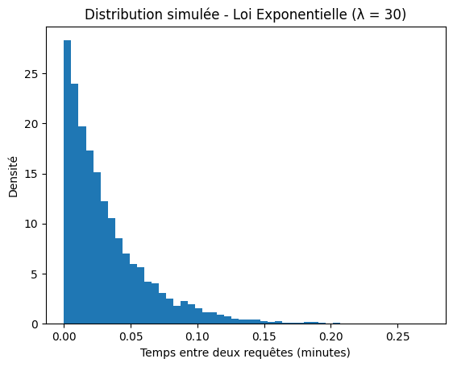

📊 Projet Probabilités – Loi Exponentielle (λ = 30)
📌 1. Définition de la variable aléatoire

On modélise :

X = temps entre deux requêtes d’une API web

On suppose que ce temps suit une loi exponentielle de paramètre :

𝜆
=
30
λ=30

Donc :

𝑋
∼
𝐸
(
30
)
X∼E(30)
📈 2. Densité de probabilité

La densité d’une loi exponentielle est :

𝑓
(
𝑥
)
=
𝜆
𝑒
−
𝜆
𝑥
,
𝑥
≥
0
f(x)=λe
−λx
,x≥0

Dans notre cas :

𝑓
(
𝑥
)
=
30
𝑒
−
30
𝑥
,
𝑥
≥
0
f(x)=30e
−30x
,x≥0
🔎 Interprétation

Les petites valeurs sont très probables

La probabilité diminue rapidement quand le temps augmente

Le modèle correspond bien à un phénomène d’attente

(Source : définition mathématique page 1 

Projet Proba loi exponentielle

)

📉 3. Espérance

Formule théorique :

𝐸
(
𝑋
)
=
1
𝜆
E(X)=
λ
1
	​

Calcul :

𝐸
(
𝑋
)
=
1
30
=
0.033333
 minute
E(X)=
30
1
	​

=0.033333 minute

Conversion en secondes :

0.033333
×
60
=
2
 secondes
0.033333×60=2 secondes

👉 En moyenne, il y a une requête toutes les 2 secondes.

📊 4. Variance

Formule :

𝑉
𝑎
𝑟
(
𝑋
)
=
1
𝜆
2
Var(X)=
λ
2
1
	​

Calcul :

𝑉
𝑎
𝑟
(
𝑋
)
=
1
30
2
=
1
900
=
0.001111
Var(X)=
30
2
1
	​

=
900
1
	​

=0.001111

Cela mesure la dispersion autour de la moyenne.

💻 5. Simulation en JavaScript
// Paramètre
let lambda = 30;

// Fonction loi exponentielle
function genererExponentielle(lambda) {
  let u = Math.random();
  return -Math.log(u) / lambda;
}

// Nombre de valeurs
let n = 10000;
let somme = 0;
let sommeCarre = 0;

// Génération des données
for (let i = 0; i < n; i++) {
  let x = genererExponentielle(lambda);
  somme += x;
  sommeCarre += x * x;
}

// Moyenne simulée
let moyenne = somme / n;

// Variance simulée
let variance = (sommeCarre / n) - (moyenne * moyenne);

console.log("Moyenne simulée :", moyenne);
console.log("Variance simulée :", variance);
console.log("Moyenne théorique :", 1 / lambda);
console.log("Variance théorique :", 1 / (lambda * lambda));

📊 6. Graphique de distribution

Le graphique de la page 4 montre :

Une forte concentration des valeurs près de 0

Une décroissance exponentielle

Une forme typique de loi exponentielle

📌 Le graphique simulé confirme la théorie :

Distribution simulée – Loi Exponentielle (λ = 30)

## 📊 Distribution Graph

  

